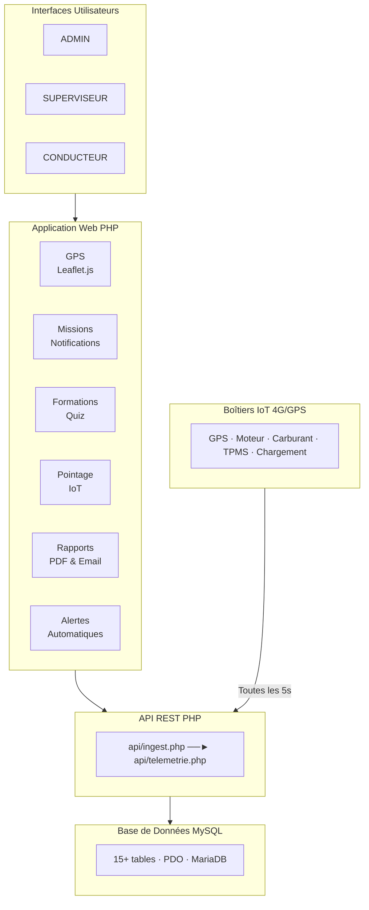
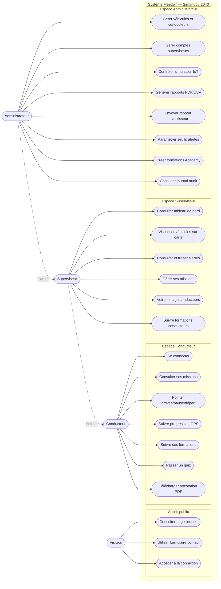
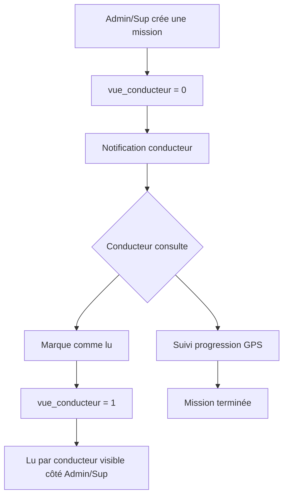

# FleetIoT : Système de Gestion de Flotte IoT
### Projet Simandou   Corridor Minier de Guinée
Application web de gestion de flotte (minier) IoT développée pour le corridor minier Simandou  en République de Guinée. Ce système permet le suivi GPS en temps réel, le suivi de niveau de carburant, la pression des pneus, l’ etat du moteur, la charge de nette des engins roulant, la gestion des missions,  le pointage et la formation des conducteurs, et les rapports investisseurs et des rapports des KPIs.
##  Fonctionnalités
-  Carte GPS temps réel (Leaflet.js)
-  Alertes automatiques (vitesse, température, TPMS, surcharge)
-  Gestion des missions avec notification conducteur
-  Pointage self-service géolocalisé
-  Simandou Academy (formations en ligne + quiz + attestation PDF)
-  Rapports investisseurs PDF par email
-  3 rôles : Admin, Superviseur, Conducteur

##  Stack technique
- **Backend** : PHP 8 + PDO
- **Base de données** : MySQL / MariaDB
- **Frontend** : HTML5, CSS3, JavaScript
- **Cartographie** : Leaflet.js
- **Graphiques** : Chart.js
- **PDF** : FPDF
- **Email** : PHPMailer

##  Installation
1. Cloner le repository
   git clone Gestion de flotte : https://github.com/mamadoumadioudiallo/Systme-Internet-of-Things-pour-la-gestion-intelligente-des-flottes-de-transport-minier.git

2. Copier les fichiers de config
   cp includes/db.example.php includes/db.php
   cp includes/mailer.example.php includes/mailer.php

3. Modifier includes/db.php avec vos identifiants

4. Importer la base de données
   mysql -u root -p fleet_iot_db < database/fleet_iot_db.sql

5. Lancer sur XAMPP → http://localhost/fleet_iot

##  Structure
## 📁 Structure du projet

```
FleetIoT-Simandou-2040/
├── 📂 admin/                    # Pages administrateur
├── 📂 api/                      # Endpoints IoT REST
├── 📂 assets/                   # CSS, JS, images
├── 📂 backups/                  # Sauvegardes base de données
├── 📂 conducteur/               # Pages conducteur
├── 📂 includes/                 # Config DB, auth, fonctions
├── 📂 lib/                      # Librairies (FPDF, PHPMailer)
├── 📂 rapports/                 # Export PDF/CSV
├── 📂 scripts/                  # Scripts utilitaires
├── 📂 simulation/               # Simulateur IoT
├── 📂 superviseur/              # Pages superviseur
├── 📂 vendor/                   # Dépendances Composer
├── 📂 websocket/                # Temps réel WebSocket
├── 📄 connexion.php             # Authentification
├── 📄 deconnexion.php           # Déconnexion
├── 📄 index.php                 # Page d'accueil
├── 📄 inscription.php           # Inscription utilisateur
├── 📄 mot_de_passe_oublie.php   # Récupération mot de passe
├── 📄 reinitialiser_mot_de_passe.php  # Réinitialisation
├── 📄 verification_2fa.php      # Double authentification
├── 📄 composer.json             # Dépendances PHP
└── 📄 README.md                 # Documentation
```

##  Architecture du système



##  Flux de données IoT

```
Boîtier GPS/IoT
      │
      │ HTTP POST (JSON) toutes les 5s
      ▼
api/ingest.php
      │
      ├──► Table `telemetrie` (MySQL)
      │
      ├──► evaluerAlertesVehicule()
      │         │
      │         └──► Table `alertes`
      │
      ▼
api/telemetrie.php
      │
      │ Polling toutes les 5s
      ▼
Dashboard (Leaflet.js + Chart.js)
      │
      ├──► Carte GPS mise à jour
      ├──► KPI recalculés
      └──► Alertes affichées
```
##  Diagramme de cas d'utilisation UML



##  Flux d'une mission



## Auteur
Mamadou Madiou Diallo — mamadoumadioudiallo@github — dmamadoumadiou61@gmail.com

##  Licence
MIT License
